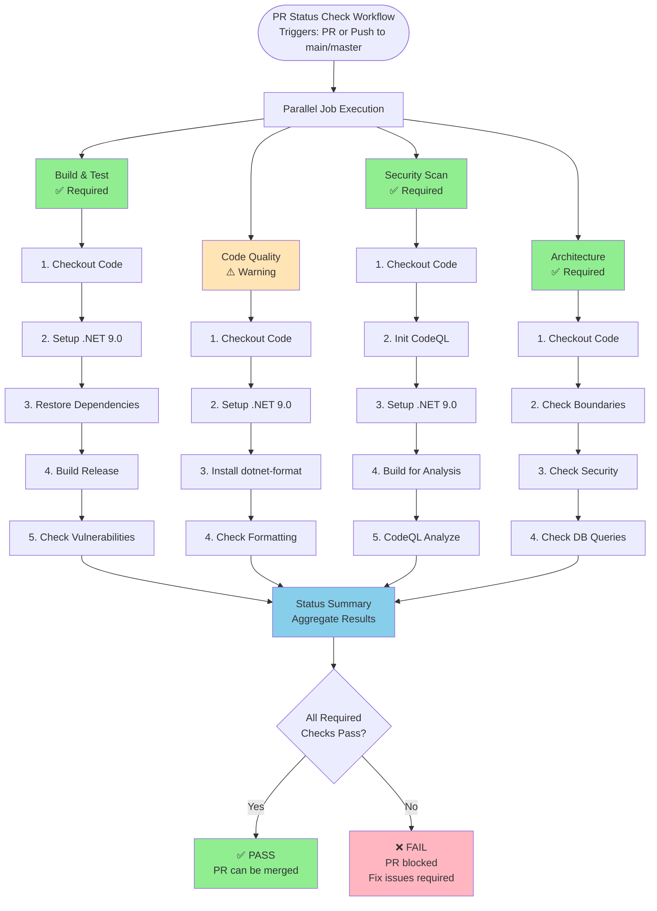

# CI/CD Pipeline Overview



## Job Details

### 1. Build and Test ✅ (Required)
- **Purpose**: Verify code compiles and is buildable
- **Duration**: ~30-60 seconds
- **Actions**:
  - Restore NuGet packages
  - Build in Release configuration
  - Check for vulnerable dependencies
- **Failure Impact**: Blocks PR merge

### 2. Code Quality ⚠️ (Warning)
- **Purpose**: Ensure code follows formatting standards
- **Duration**: ~20-40 seconds  
- **Actions**:
  - Install dotnet-format tool
  - Verify code formatting
- **Failure Impact**: Warning only, does not block merge

### 3. Security Scan ✅ (Required)
- **Purpose**: Detect security vulnerabilities
- **Duration**: ~2-5 minutes
- **Actions**:
  - Initialize CodeQL
  - Build with instrumentation
  - Analyze for vulnerabilities
- **Failure Impact**: Blocks PR merge

### 4. Architecture Validation ✅ (Required)
- **Purpose**: Enforce architectural constraints and patterns
- **Duration**: ~10-20 seconds
- **Actions**:
  - Check architecture boundaries (layer dependencies)
  - Validate security patterns (credentials, middleware order)
  - Analyze database query patterns (performance)
- **Failure Impact**: Blocks PR merge on critical violations

### 5. Status Summary
- **Purpose**: Aggregate results and provide final verdict
- **Duration**: ~5-10 seconds
- **Actions**:
  - Check all job statuses
  - Report final pass/fail
- **Failure Impact**: Overall PR status

## Local Development

Run checks before pushing:

```bash
# Run all pre-commit checks
./check-pr.sh

# Run architecture validation only
bash scripts/check-architecture.sh
bash scripts/check-security-patterns.sh
bash scripts/check-database-queries.sh
```

This runs the same validations locally, helping catch issues early.
