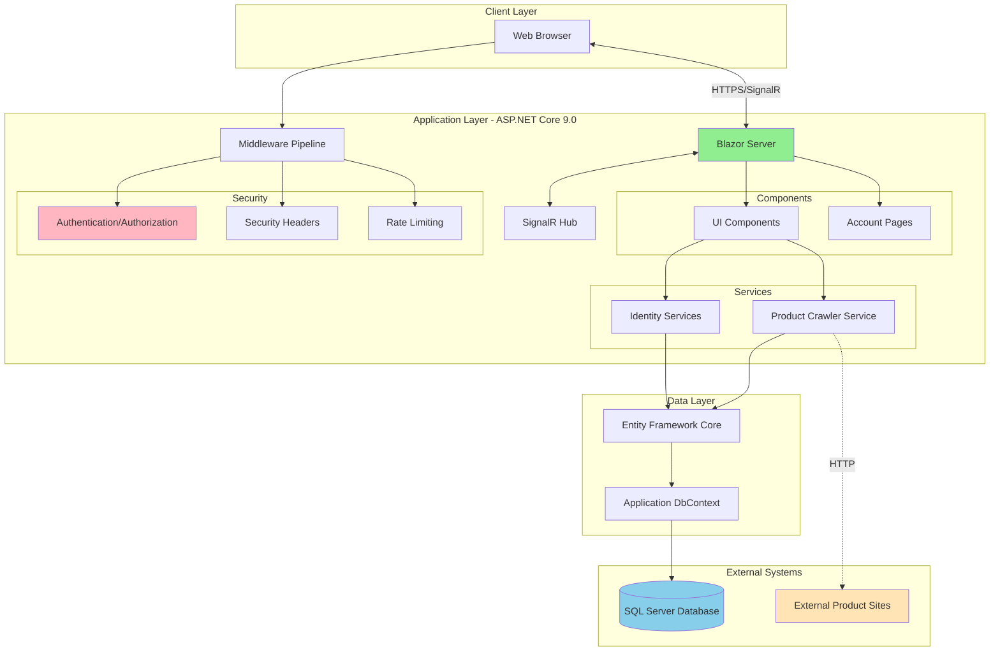
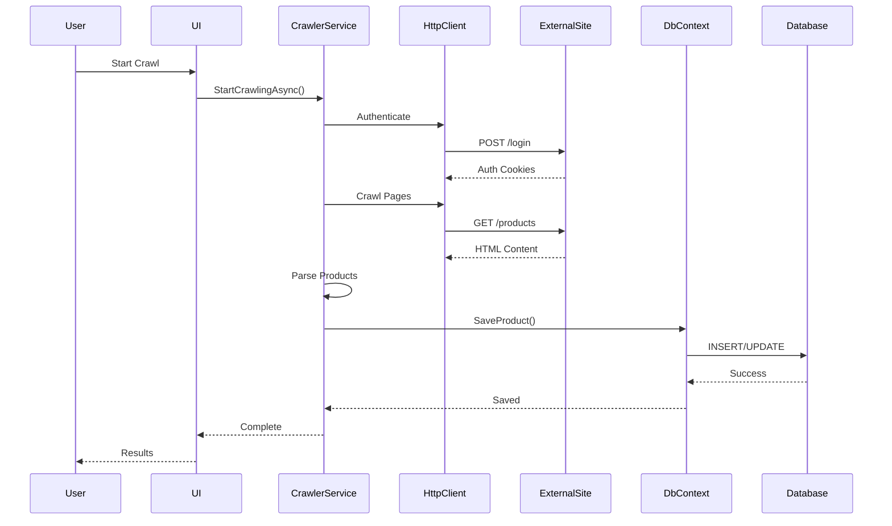
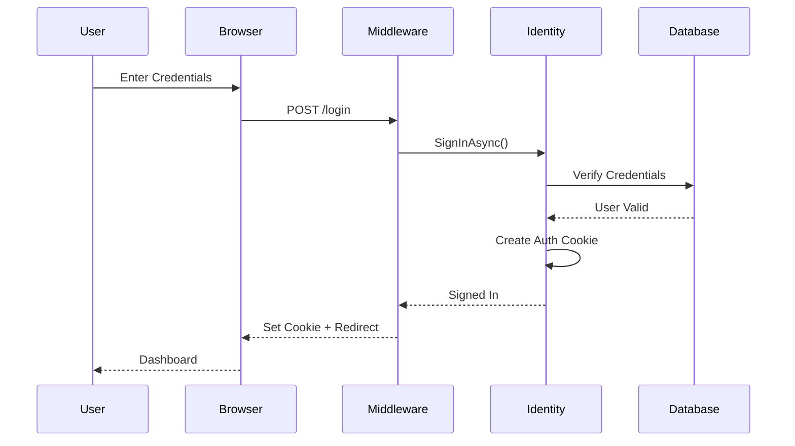
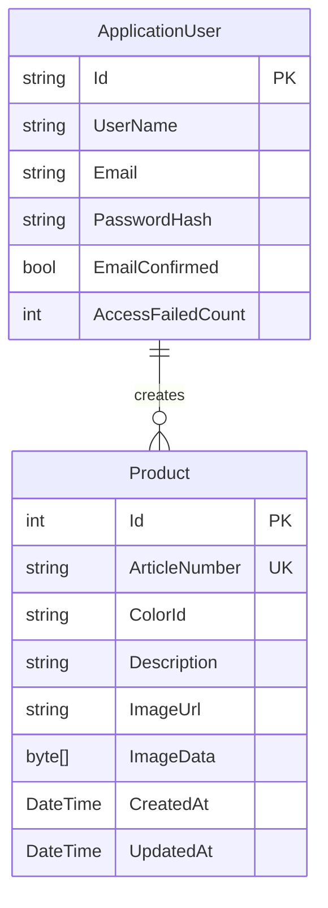

# Architecture Overview

## System Purpose

The Product Manager is a web-based application for managing product information with automated web crawling capabilities. It provides secure authentication, product data storage, and automated product information collection from external sources.

## High-Level Architecture



## Layered Architecture

### Presentation Layer
- **Blazor Components** - Interactive UI components using Fluent UI
- **Razor Pages** - Account management pages (login, register, etc.)
- **SignalR** - Real-time communication between server and browser

### Application Layer
- **Services** - Business logic (Product Crawler, Identity management)
- **Middleware** - Cross-cutting concerns (security, rate limiting)
- **Controllers** - API endpoints (if needed in future)

### Data Layer
- **Entity Framework Core** - ORM for data access
- **DbContext** - Database context and configuration
- **Migrations** - Database schema versioning

### Infrastructure Layer
- **SQL Server** - Persistent data storage
- **Configuration** - appsettings.json, User Secrets, Environment Variables
- **Logging** - Built-in ASP.NET Core logging

## Key Patterns

### Dependency Injection
All services are registered in `Program.cs` and injected where needed:
```csharp
builder.Services.AddScoped<ProductCrawlerService>();
builder.Services.AddSingleton<CrawlerSettings>();
```

### Repository Pattern (via EF Core)
DbContext acts as a Unit of Work and repository:
```csharp
public class ApplicationDbContext : IdentityDbContext<ApplicationUser>
{
    public DbSet<Product> Products { get; set; }
}
```

### Middleware Pipeline
Security and cross-cutting concerns implemented as middleware:
- HTTPS Redirection
- Security Headers
- Rate Limiting
- Antiforgery Protection

### Options Pattern
Configuration bound to strongly-typed classes:
```csharp
var crawlerSettings = new CrawlerSettings();
builder.Configuration.GetSection("CrawlerSettings").Bind(crawlerSettings);
```

## Data Flow

### Product Crawling Flow


### Authentication Flow


## Security Architecture

### Defense in Depth Layers

1. **Transport Security** - HTTPS with HSTS
2. **Authentication** - ASP.NET Core Identity with strong passwords
3. **Authorization** - Role-based access control
4. **Input Validation** - Antiforgery tokens, model validation
5. **Output Encoding** - Blazor auto-escaping
6. **Security Headers** - CSP, X-Frame-Options, etc.
7. **Rate Limiting** - DoS protection (100 req/min per IP)
8. **Request Limits** - Max body size, header size limits

### Security Middleware Pipeline Order
```
1. UseHttpsRedirection()
2. UseSecurityHeaders()
3. UseRateLimiting()
4. UseAuthentication()
5. UseAuthorization()
6. UseAntiforgery()
```

## Database Schema

### Core Entities



## Scalability Considerations

### Current State (Single Instance)
- Blazor Server maintains SignalR connections
- In-memory rate limiting (per-instance)
- LocalDB for development, SQL Server for production

### Future Scaling Options
1. **Horizontal Scaling**
   - Move to Blazor WebAssembly for stateless client
   - Use distributed cache (Redis) for rate limiting
   - Connection pooling for database

2. **Vertical Scaling**
   - Increase server resources
   - Optimize database queries
   - Add caching layer

3. **Database Scaling**
   - Read replicas for queries
   - Partitioning by customer/date
   - Azure SQL elastic pools

## Monitoring & Observability

### Logging
- Built-in ASP.NET Core logging
- Log levels: Information, Warning, Error
- Structured logging ready for Application Insights

### Health Checks (Future)
- Database connectivity
- External service availability
- Memory/CPU metrics

## Technology Decisions

See [Architecture Decision Records (ADRs)](../adr/) for detailed rationale on:
- ADR-001: Blazor Server vs Blazor WebAssembly
- ADR-002: Entity Framework Core for data access
- ADR-003: ASP.NET Core Identity for authentication
- ADR-004: SQL Server as database
- ADR-005: Middleware-based security architecture
