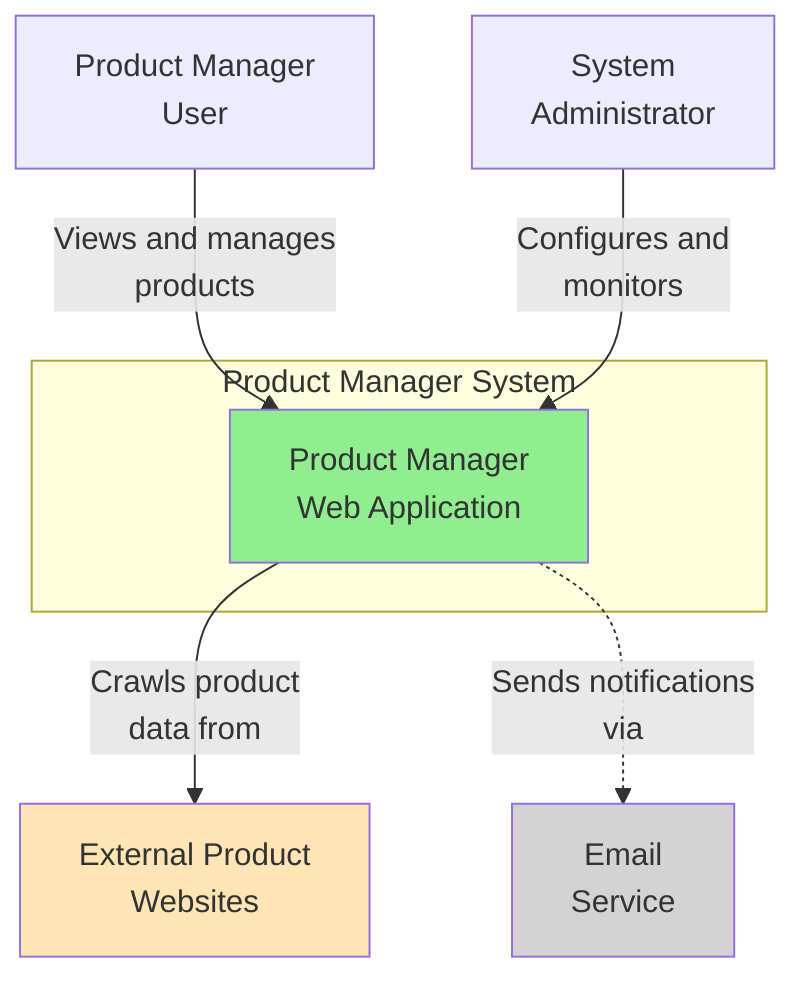
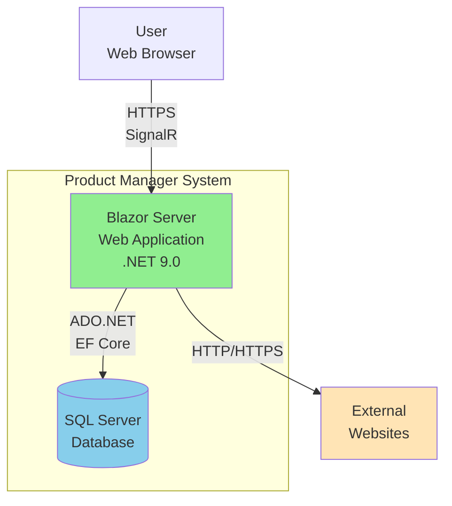
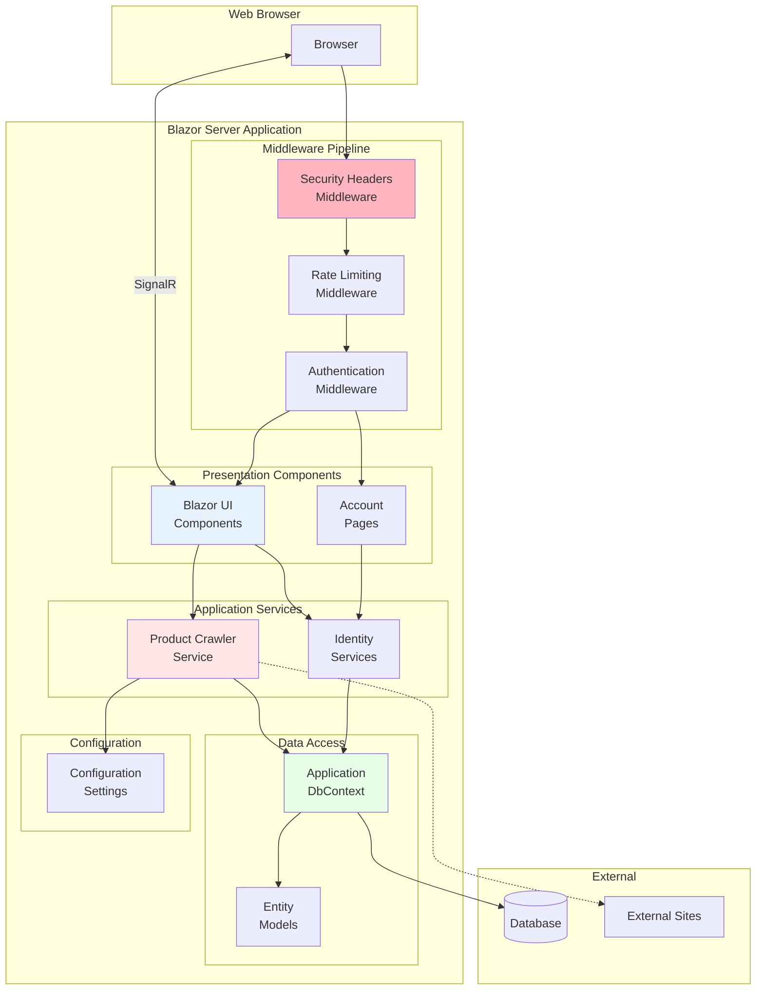
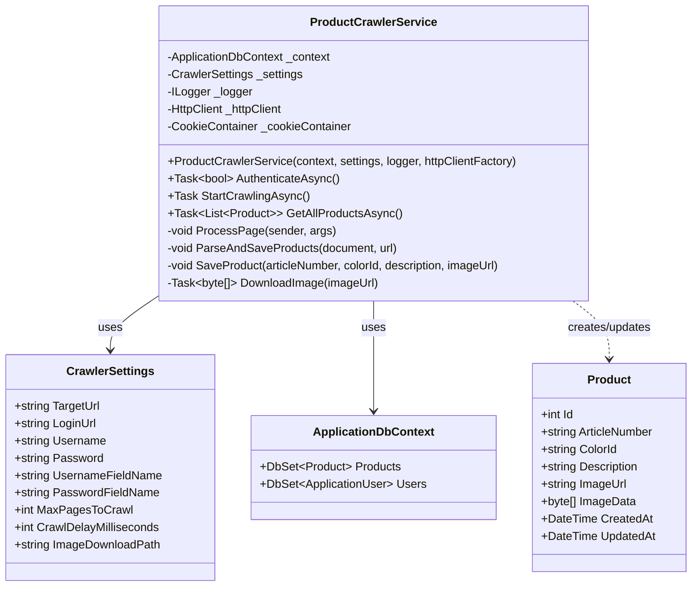
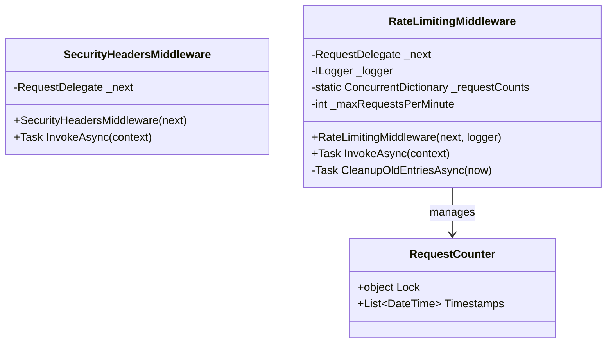
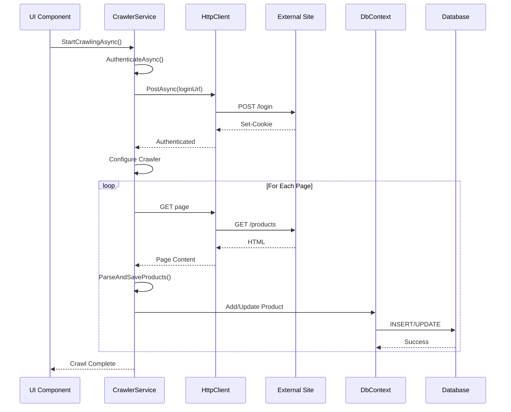
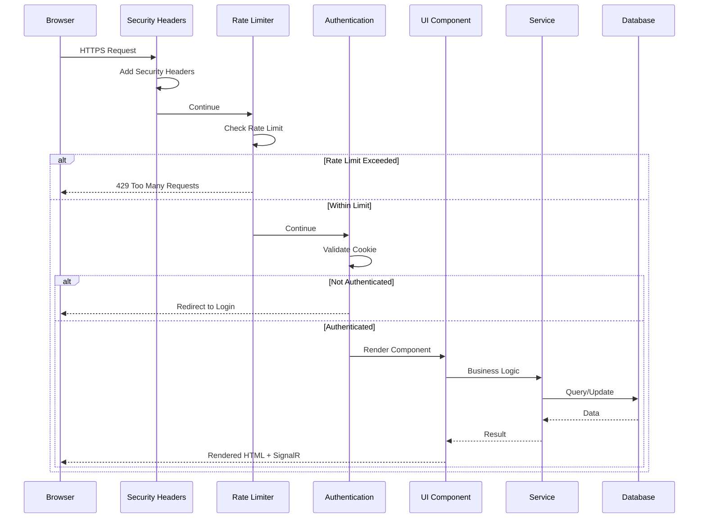
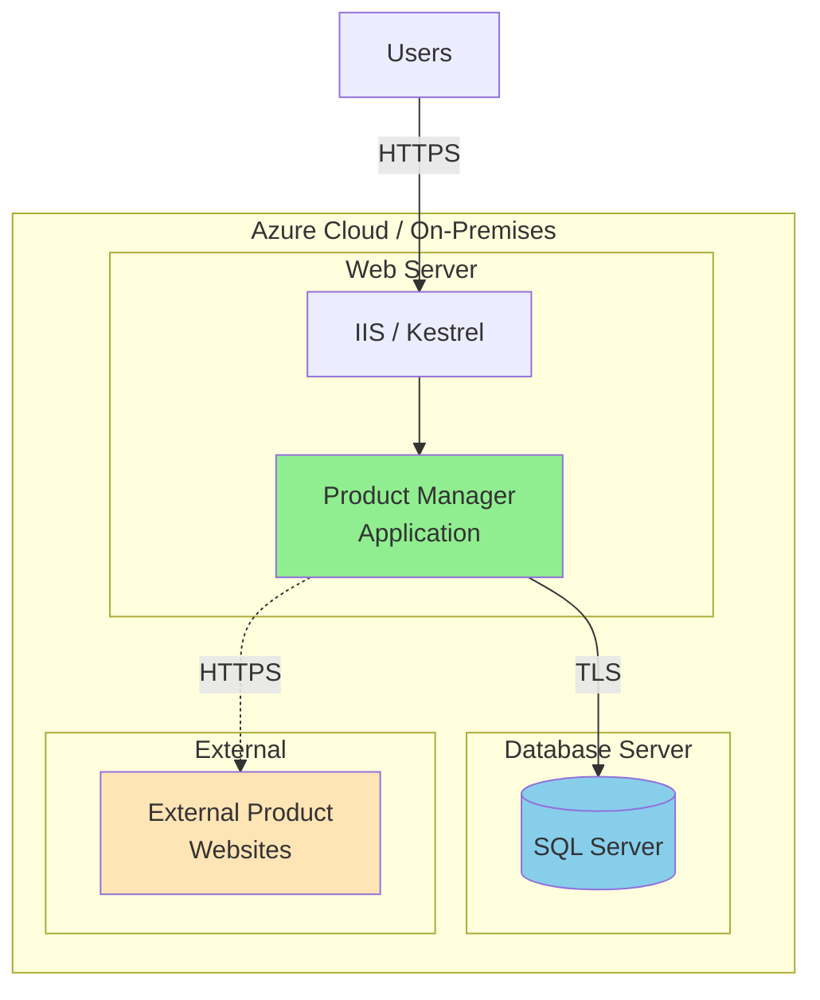

# C4 Model Diagrams

This document presents the system architecture using the C4 model (Context, Container, Component, Code).

## Level 1: System Context

Shows how the Product Manager system fits into the wider environment.

### System Context Description

**Product Manager System**: Web-based application for managing product information with automated web crawling.

**Users**:
- **Product Managers**: View, search, and manage product catalog
- **System Administrators**: Configure crawler settings, manage users

**External Systems**:
- **External Product Websites**: Source of product data for crawling
- **Email Service** (Future): For notifications and account management

## Level 2: Container Diagram

Shows the high-level technical building blocks.

### Container Descriptions

**Blazor Server Web Application**
- Technology: ASP.NET Core 9.0, Blazor Server, C#
- Purpose: Hosts UI and business logic
- Communication: HTTPS with SignalR for real-time updates

**SQL Server Database**
- Technology: SQL Server (LocalDB for dev, full SQL Server for prod)
- Purpose: Stores user accounts, products, and application state
- Access: Entity Framework Core ORM

## Level 3: Component Diagram

Shows the major components within the web application container.

### Component Descriptions

#### Presentation Layer

**Blazor UI Components**
- Responsibilities: Render UI, handle user interactions
- Technology: Razor components, Fluent UI library
- Examples: Product list, product details, dashboard

**Account Pages**
- Responsibilities: User authentication flows
- Technology: Razor Pages, ASP.NET Core Identity
- Examples: Login, Register, Password Reset

#### Middleware Layer

**Security Headers Middleware**
- Responsibilities: Add security headers (CSP, X-Frame-Options, etc.)
- Pattern: ASP.NET Core Middleware
- Execution: Early in pipeline

**Rate Limiting Middleware**
- Responsibilities: Prevent DoS attacks, limit requests per IP
- Pattern: Custom middleware with in-memory tracking
- Limits: 100 requests/minute per IP

**Authentication Middleware**
- Responsibilities: Validate user identity
- Technology: ASP.NET Core Identity
- Features: Cookie-based auth, lockout, 2FA support

#### Application Services

**Product Crawler Service**
- Responsibilities: Crawl external sites, extract product data
- Dependencies: Abot2 crawler, HttpClient, DbContext
- Pattern: Scoped service with dependency injection

**Identity Services**
- Responsibilities: User management, authentication
- Technology: ASP.NET Core Identity
- Features: User CRUD, password management, roles

#### Data Access Layer

**Application DbContext**
- Responsibilities: Database operations, change tracking
- Technology: Entity Framework Core
- Pattern: Unit of Work + Repository

**Entity Models**
- Responsibilities: Domain models
- Examples: ApplicationUser, Product
- Mapping: Code-First with migrations

## Level 4: Code Diagram (Selected Components)

### Product Crawler Service Class Diagram

### Security Middleware Class Diagram

## Component Interactions

### Crawling Process Sequence

### Request Processing Pipeline

## Deployment View

Shows how components are deployed to infrastructure.

## Technology Mapping

| Layer | Technology | Version |
|-------|-----------|---------|
| Frontend | Blazor Server | .NET 9.0 |
| UI Library | Microsoft Fluent UI | 4.13.2 |
| Backend Framework | ASP.NET Core | 9.0 |
| ORM | Entity Framework Core | 9.0.9 |
| Database | SQL Server | 2019+ |
| Authentication | ASP.NET Core Identity | 9.0.9 |
| Web Crawler | Abot2 | 2.0.70 |
| Logging | ILogger | Built-in |
| DI Container | Microsoft.Extensions.DI | Built-in |

## Cross-Cutting Concerns

### Security
- Implemented via middleware pipeline
- Multiple defense layers
- Documented in SECURITY.md

### Logging
- Structured logging via ILogger
- Injected into all services
- Configurable log levels

### Configuration
- appsettings.json for defaults
- User Secrets for development
- Environment variables for production
- Options pattern for strongly-typed config

### Error Handling
- Global exception handler in production
- Developer exception page in development
- Validation errors at model level

## Evolution and Future State

### Current Architecture (v1.0)
- Monolithic Blazor Server application
- Single database instance
- In-memory rate limiting
- Manual crawler triggers

### Planned Improvements (v2.0)
- Scheduled crawler jobs (Hangfire/Quartz)
- Distributed caching (Redis)
- Message queue for async processing
- Health checks and metrics
- API endpoints for integration

### Future Consideration (v3.0)
- Microservices architecture
- Event-driven with message bus
- CQRS pattern for scalability
- Separate read/write databases
