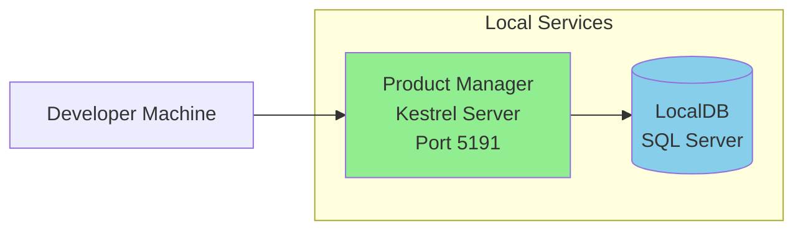
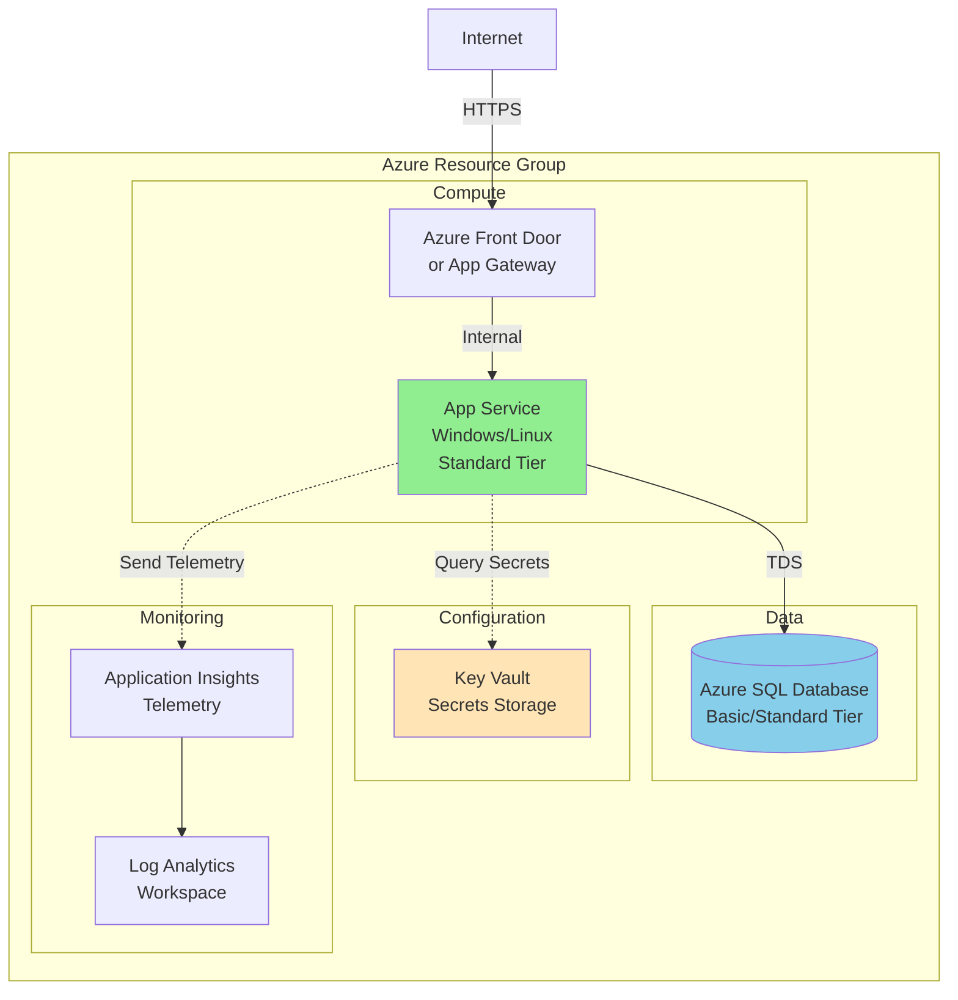
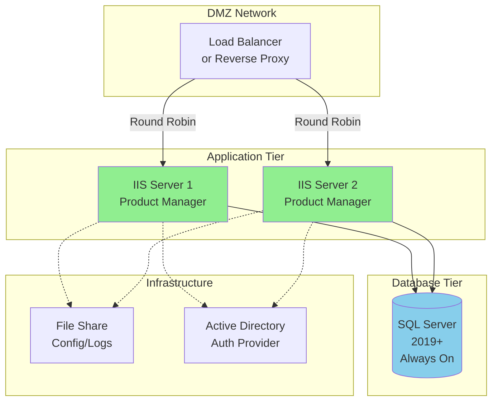
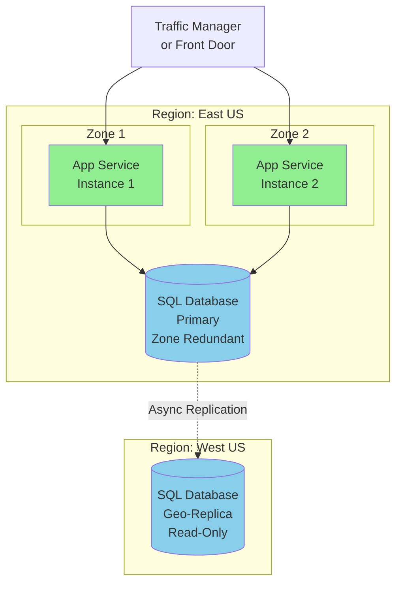

# Deployment Architecture

## Current Deployment Model

### Development Environment

**Local Development Setup**:
- Developer workstation running Product Manager application
- LocalDB instance for database
- User Secrets for configuration management
- No external dependencies required

**Infrastructure Components**:


### Production Deployment Options

#### Option 1: Azure App Service (Recommended)



**Resource Specifications**:
- **App Service**: Standard S1 (1 core, 1.75 GB RAM)
- **SQL Database**: Standard S0 (10 DTUs)
- **Key Vault**: Standard tier
- **Application Insights**: Pay-as-you-go

**Configuration Requirements**:
- Environment Variables: ConnectionStrings__DefaultConnection
- Key Vault Secrets: CrawlerSettings--Username, CrawlerSettings--Password
- App Service Settings: ASPNETCORE_ENVIRONMENT=Production

#### Option 2: On-Premises Windows Server



**Server Specifications**:
- **Web Servers**: Windows Server 2019+, 4 cores, 8GB RAM each
- **Database Server**: Windows Server 2019+, 8 cores, 32GB RAM, SSD storage
- **Network**: 1Gbps internal, firewall rules for port 443, 1433

### Environment Configuration Matrix

| Setting | Development | Staging | Production |
|---------|------------|---------|------------|
| Database | LocalDB | Azure SQL Basic | Azure SQL Standard |
| Secrets | User Secrets | Key Vault | Key Vault |
| Logging | Console | App Insights | App Insights |
| HTTPS | Self-signed | Managed Cert | Managed Cert |
| Rate Limiting | Disabled | 100/min | 50/min |
| SignalR Timeout | 5 min | 3 min | 3 min |

## Deployment Procedures

### Azure App Service Deployment

**Prerequisites**:
1. Azure subscription with appropriate permissions
2. Azure CLI installed locally
3. Git repository access

**Automated Deployment (GitHub Actions)**:

The application can be deployed automatically using the existing CI/CD pipeline with additional deployment steps.

**Manual Deployment Steps**:
```bash
# Login to Azure
az login

# Create resource group
az group create --name ProductManagerRG --location eastus

# Create App Service plan
az appservice plan create \
  --name ProductManagerPlan \
  --resource-group ProductManagerRG \
  --sku S1 --is-linux

# Create web app
az webapp create \
  --name productmanager-app \
  --resource-group ProductManagerRG \
  --plan ProductManagerPlan \
  --runtime "DOTNET|9.0"

# Create SQL Database
az sql server create \
  --name productmanager-sql \
  --resource-group ProductManagerRG \
  --admin-user sqladmin \
  --admin-password 'SecureP@ssw0rd!'

az sql db create \
  --name ProductManagerDB \
  --server productmanager-sql \
  --resource-group ProductManagerRG \
  --service-objective S0

# Configure connection string
az webapp config connection-string set \
  --name productmanager-app \
  --resource-group ProductManagerRG \
  --connection-string-type SQLAzure \
  --settings DefaultConnection='Server=tcp:productmanager-sql.database.windows.net...'

# Deploy application
dotnet publish -c Release
cd bin/Release/net9.0/publish
zip -r app.zip *
az webapp deployment source config-zip \
  --resource-group ProductManagerRG \
  --name productmanager-app \
  --src app.zip
```

### Scaling Strategies

**Vertical Scaling (Scale Up)**:
- Move to higher App Service tier (P1V2, P2V2)
- Increase SQL Database DTUs
- Suitable for: Increased per-user performance needs

**Horizontal Scaling (Scale Out)**:
- Add more App Service instances
- Configure SignalR with Azure SignalR Service
- Use Redis for distributed rate limiting
- Suitable for: More concurrent users

**Database Scaling**:
- Read replicas for query performance
- Elastic pools for multiple tenants
- Sharding for very large datasets

## High Availability Configuration

### Azure Setup (99.95% SLA)



**Configuration**:
- App Service: Enable zone redundancy (requires Premium tier)
- SQL Database: Enable zone-redundant configuration
- Configure automatic failover groups for database
- Health probes every 30 seconds

### Disaster Recovery

**Backup Strategy**:
- **Database**: Automated daily backups with 7-day retention
- **Application**: Source code in Git, artifacts in releases
- **Configuration**: Key Vault with soft-delete enabled

**Recovery Procedures**:
1. Point-in-time restore for SQL (within 7 days)
2. Geo-restore from backup to different region
3. Redeploy application from Git tag
4. Restore Key Vault secrets from backup

**RTO/RPO Targets**:
- Recovery Time Objective (RTO): 4 hours
- Recovery Point Objective (RPO): 1 hour

## Security Hardening

### Network Security

**Inbound Rules**:
- Allow HTTPS (443) from internet
- Allow SSH (22) only from management IPs
- Deny all other inbound traffic

**Outbound Rules**:
- Allow HTTPS (443) to external sites (for crawler)
- Allow SQL (1433) to database
- Allow HTTPS to Azure services
- Deny all other outbound traffic

**Additional Protections**:
- Azure DDoS Protection Standard
- Web Application Firewall (WAF) rules
- Network Security Groups (NSGs)
- Private endpoints for SQL Database

### Application Security

**Identity & Access**:
- Managed Identity for App Service to Key Vault
- No credentials in code or configuration
- SQL authentication only from App Service subnet

**Data Protection**:
- TLS 1.2+ for all connections
- Transparent Data Encryption (TDE) for SQL
- Encrypted backups

## Monitoring & Alerting

### Key Metrics to Monitor

**Application Metrics**:
- Request rate and response time
- Exception rate
- SignalR connection count
- Memory and CPU usage

**Database Metrics**:
- DTU percentage
- Connection count
- Deadlocks
- Query performance

**Alert Configuration**:
```yaml
alerts:
  high_cpu:
    threshold: 80%
    duration: 5 minutes
    action: notify_ops_team
    
  high_error_rate:
    threshold: 5%
    duration: 2 minutes
    action: notify_dev_team
    
  database_dtu:
    threshold: 90%
    duration: 10 minutes
    action: consider_scaling
    
  crawler_failures:
    threshold: 3 consecutive
    action: notify_ops_team
```

### Logging Strategy

**Log Levels by Environment**:
- Development: Debug and above
- Staging: Information and above
- Production: Warning and above

**Log Aggregation**:
- Application Insights for structured logging
- Log Analytics for long-term retention
- Alerts based on log patterns

## Cost Optimization

### Azure Cost Estimates (Monthly)

| Resource | Tier | Estimated Cost |
|----------|------|----------------|
| App Service | S1 | $70 |
| SQL Database | S0 | $15 |
| Key Vault | Standard | $5 |
| Application Insights | 5GB/month | $10 |
| **Total** | | **~$100/month** |

**Cost Saving Tips**:
- Use Dev/Test pricing for non-production
- Stop non-production resources outside business hours
- Right-size based on actual usage metrics
- Use reserved instances for predictable workloads

## Infrastructure as Code

To implement true "Infrastructure as Code", consider:

**Terraform Configuration** (future enhancement):
- Define all Azure resources in HCL
- Version control infrastructure changes
- Apply via CI/CD pipeline
- Separate state per environment

**ARM Templates** (Azure native):
- JSON-based resource definitions
- Template parameters for environments
- Deploy via Azure DevOps or GitHub Actions

**Bicep** (recommended for Azure):
- Simpler syntax than ARM
- Strong typing and IntelliSense
- Transpiles to ARM templates
- Better error messages

Example Bicep structure for future:
```
infrastructure/
├── main.bicep
├── modules/
│   ├── app-service.bicep
│   ├── sql-database.bicep
│   ├── key-vault.bicep
│   └── monitoring.bicep
└── parameters/
    ├── dev.parameters.json
    ├── staging.parameters.json
    └── prod.parameters.json
```
